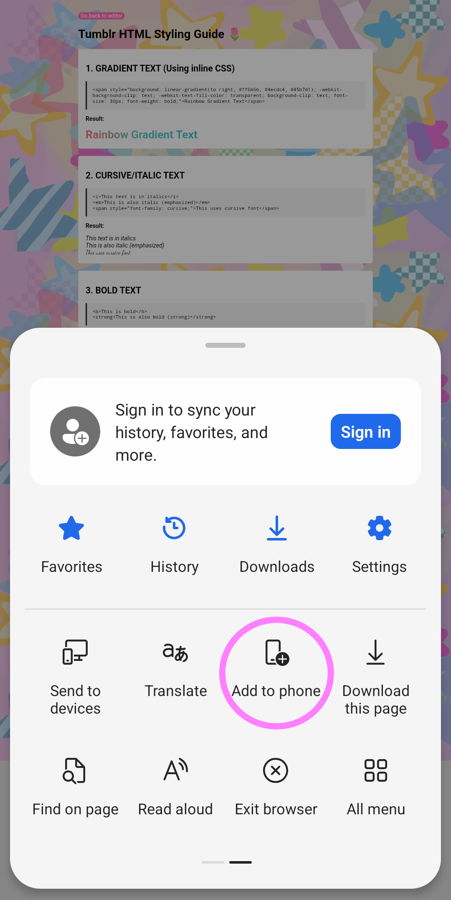
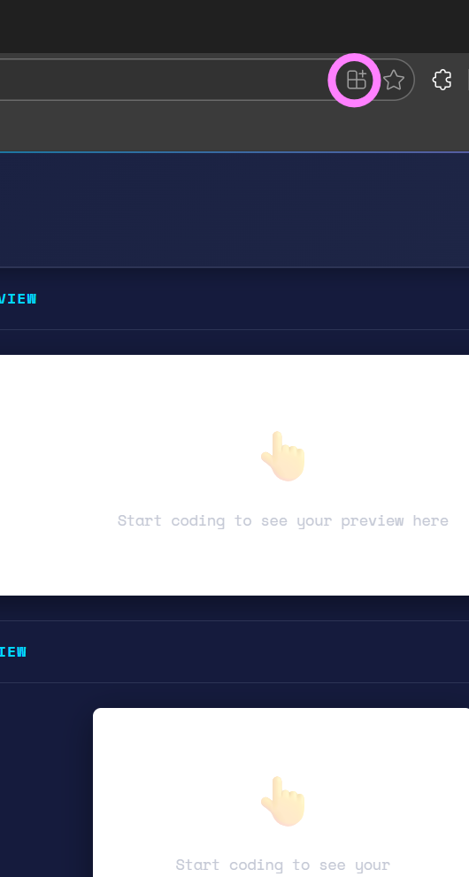
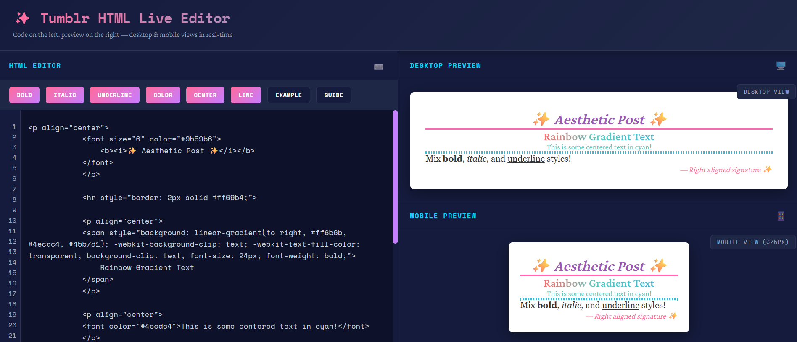
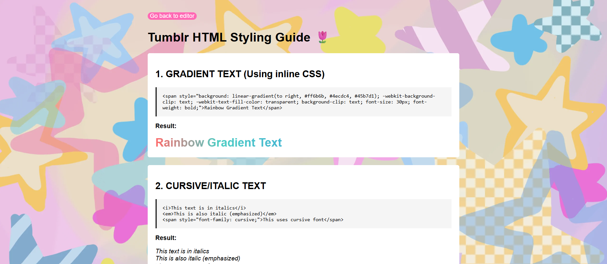

<div align="center">
  <br>
  
  <h1>🌷 tutipost 🌷</h1>
  <strong>This contains HTML editor and guide that you can use for your posts! *:･ﾟ✧</strong>
</div>

## Summary

| #   | Section                                                                                        |
| --- | -----------------------------------------------------------------------------------------------|
| 🪄   | [Editor](https://lucia-aranda.github.io/tutipost/): HTML input and desktop/movile output.      |
| 📖   | [Guide](https://lucia-aranda.github.io/tutipost/guide): Text, patterns and multimedia styling. |

## Prerequisites

To run the project locally, you need a development environment installed on your personal computer:

- `Visual Studio Code`

 This optional VSC extension:

```
Live Server by Ritwick Dey
```

Or any other code editor you like. Also internet conection 🌐 to propertly load urls.

## Concept

This webpages contains and editor and guide with basic HTML and CSS styling tags that can help you make personalized posts. 
With this guide you will learn how to create gradient text, cursive/italic/bold text, font styles, horizontal and vertical 
colored lines, align text, colored text, font sized, manage links on text and multimedia, multimedia styling and more. 📀

It focuses on structure and design, which can help you understand a lil bit how html works and know where to start.
You can use this to customize your own blog/description/quotes/and more. 📜

This will to help you make posts prettier. ✨

## Installation

This is a PWA, wich means you can install it from the browser to your own mobile phone 📱 or desk 💻, searching the installation button on the browser's menu.

 

## Contributing

Feel free to <a>DM me</a> 💬 if you have any question(s)/need help/concern(s) about, or want to contribute! :)

## Quick visualization



